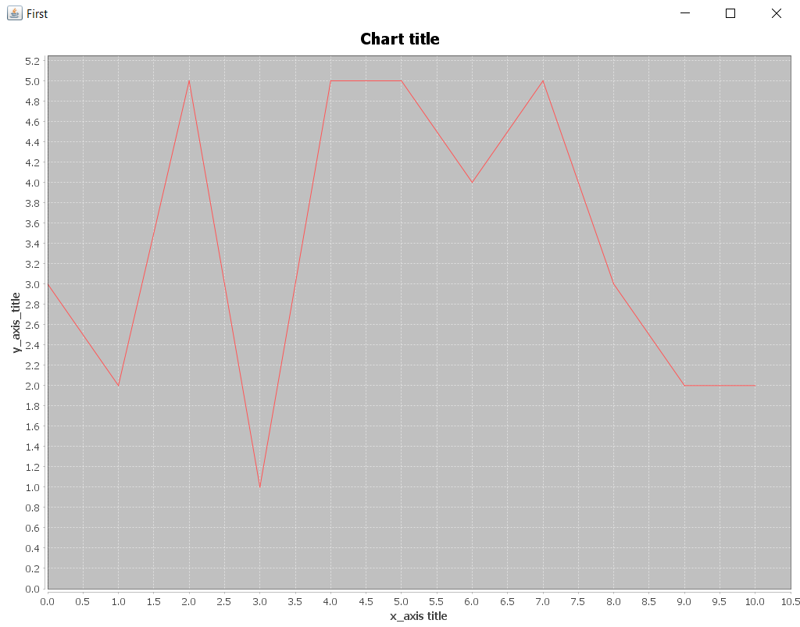

# SEIP2019


### The goal of this project is to create a Java application using the MAVEN build-automation tool.

## What it does

This application reads a file with students' grades and generates its histogram.

## Getting started

Run on terminal:

```mvn compile package```

You will find the executable jar here:

```SEIP2019\seip2019\gradeshistogram\target```

Move to the path above on your terminal and run:

```java -jar gradeshistogram-0.0.1-SNAPSHOT-jar-with-dependencies <path of grades.txt>``` 

Enjoy!

## Result preview

Let's say you want to use this file (grades.txt): [grades.txt](grades.txt)

The result you will get is the following:



## Build with

* [Maven](https://maven.apache.org/) - Dependency Management


## Authors

* <b>Ion Petropoulos</b> - Initial work
* <b>Antonis Gkortzis</b> - Project Evaluation

## License 

This project is licensed under the MIT license - see the [LICENSE.md](LICENSE.md) file for details