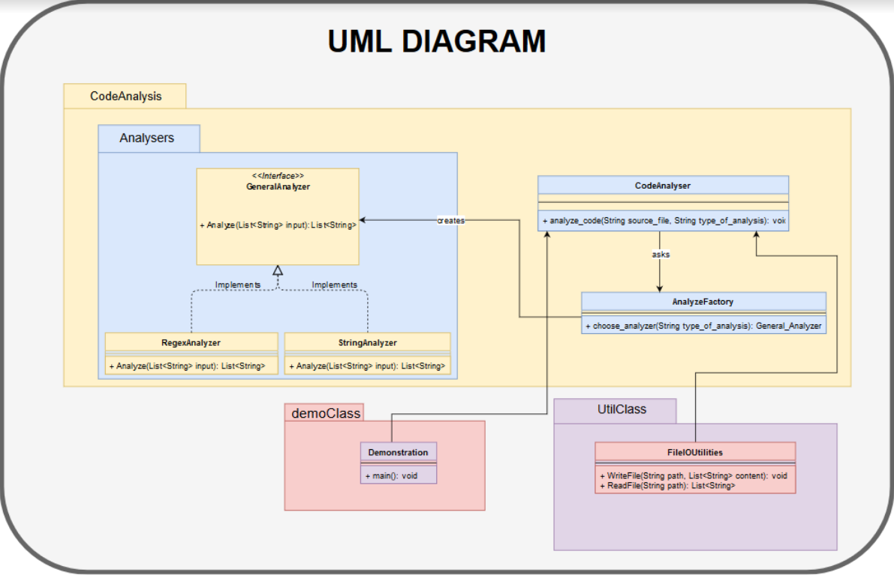

# Welcome to the Java Metrics Module

Wanna know your java program metric in a blink of an eye?

You are in the right place!

## What it does

This application reads a **java** file and writes some metrics of the program on a csv file.

The metrics included in the project are:

* Number of Classes
* Number of Methods
* Lines of Code

## Getting started

```mvn compile install```

You will find the executable jar here:

```SEIP2019\seip2019\JavaCodeAnalysis\target```

Move to the path above on your terminal and run:

```java -jar java_code_analyser-0.0.1-SNAPSHOT-jar-with-dependencies.jar [sourceFile] [string or regex]``` 

You can find the results of the analysis here:

```SEIP2019\seip2019\JavaCodeAnalysis\target\test.csv```

Enjoy!

## UML DIAGRAM



## Note

Let me note here that for this module there are no dependencies, so if you make the appropriate changes at the pom.xml you can 
run the simple jar :)