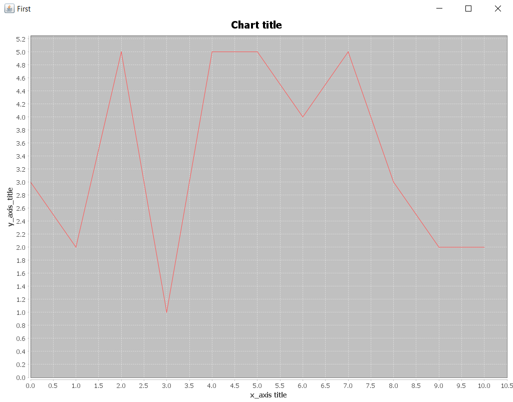

# Welcome to the GradesHistogram Module

Are you a dedicated teacher/professor and you want to see the grades frequency of your class in a histogram?

This is the right tool for you!

## What it does

This application reads a file with students' grades and generates its histogram.

## Getting started

Run on terminal:

```mvn compile package```

You will find the executable jar here:

```SEIP2019\seip2019\gradeshistogram\target```

Move to the path above on your terminal and run:

```java -jar gradeshistogram-0.0.1-SNAPSHOT-jar-with-dependencies <path of grades.txt>``` 

Enjoy!

## Result preview

Let's say you want to use this file (grades.txt): [grades.txt](grades.txt)

The result you will get is the following:



## Library Used:

[```JFreeChart```](http://www.jfree.org/jfreechart/)

